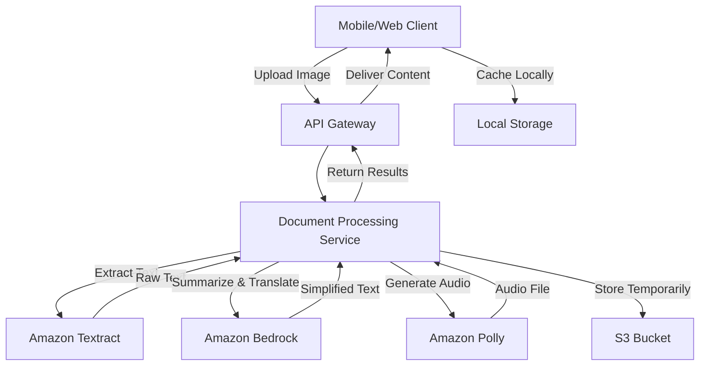

# Design Document: Vani-Chitra

## Overview

Vani-Chitra is a document accessibility application that transforms complex official documents into simplified, accessible content for rural Indian populations. The system follows a pipeline architecture where document images flow through OCR extraction, AI-powered processing, and text-to-speech synthesis to produce both textual summaries and audio output in regional languages.

### Design Goals

1. **Accessibility First**: Prioritize users with limited literacy and language barriers
2. **Offline Resilience**: Support offline access to previously processed documents
3. **Multi-Language Support**: Handle 10+ Indian regional languages seamlessly
4. **Privacy Protection**: Minimize data retention and encrypt all sensitive information
5. **Performance**: Process documents quickly even on basic smartphones

### Technology Stack

- **Frontend**: React Native (cross-platform mobile) with web fallback
- **Backend**: Node.js/Express API server
- **OCR**: Amazon Textract
- **AI Processing**: Amazon Bedrock (Claude 3 Sonnet)
- **Text-to-Speech**: Amazon Polly
- **Storage**: Local device storage (encrypted) + S3 for temporary processing
- **Database**: DynamoDB for user preferences and session management

## Architecture

### System Components



### Data Flow

1. **Image Upload**: User captures/uploads document image → API Gateway → S3 temporary storage
2. **OCR Processing**: Image → Textract → Extracted text with confidence scores
3. **Language Detection**: Extracted text → Language detection service → Source language identified
4. **Summarization**: Extracted text + user preferences → Bedrock → Simplified summary
5. **Translation**: Summary (if needed) → Bedrock → Translated to target language
6. **Audio Generation**: Translated summary → Polly → Audio file (MP3)
7. **Delivery**: Summary + Audio → Client → Local cache
8. **Cleanup**: Temporary files deleted after 24 hours

### Component Responsibilities

**Mobile/Web Client**:
- Image capture and upload
- User preference management
- Audio playback controls
- Local caching and offline access
- UI rendering in target language

**API Gateway**:
- Request routing and authentication
- Rate limiting and throttling
- Request/response transformation

**Document Processing Service**:
- Orchestrates the processing pipeline
- Manages AWS service interactions
- Handles retries and error recovery
- Implements business logic

**AWS Services**:
- Textract: Text extraction from images
- Bedrock: Summarization, translation, Q&A
- Polly: Text-to-speech synthesis
- S3: Temporary file storage
- DynamoDB: User preferences and metadata

## Components and Interfaces

### 1. Document Upload API

**Endpoint**: `POST /api/v1/documents/upload`

**Request**:
```json
{
  "image": "base64_encoded_image_data",
  "format": "jpeg|png|heic",
  "targetLanguage": "hi|mr|ta|te|bn|gu|kn|ml|pa|en",
  "userId": "string"
}
```

**Response**:
```json
{
  "documentId": "string",
  "status": "processing|completed|failed",
  "estimatedTime": "number (seconds)"
}
```

**Validation**:
- Image size ≤ 10MB
- Supported formats only
- Valid target language code

### 2. OCR Service Interface

**Function**: `extractText(imageBuffer: Buffer): Promise<OCRResult>`

**OCRResult**:
```typescript
interface OCRResult {
  text: string;
  confidence: number;
  detectedLanguage: string;
  blocks: TextBlock[];
  metadata: {
    pageCount: number;
    processingTime: number;
  };
}

interface TextBlock {
  text: string;
  confidence: number;
  boundingBox: BoundingBox;
  blockType: 'LINE' | 'WORD' | 'HEADING';
}
```

**Error Handling**:
- Retry up to 3 times on failure
- Return confidence scores for quality assessment
- Preserve document structure

### 3. Intelligence Service Interface

**Function**: `summarizeDocument(text: string, options: SummaryOptions): Promise<Summary>`

**SummaryOptions**:
```typescript
interface SummaryOptions {
  sourceLanguage: string;
  targetLanguage: string;
  readingLevel: number; // 5 for 5th grade
  preserveStructure: boolean;
}
```

**Summary**:
```typescript
interface Summary {
  simplifiedText: string;
  keyPoints: string[];
  criticalInfo: {
    dates: string[];
    amounts: string[];
    deadlines: string[];
    actions: string[];
  };
  sections: Section[];
}

interface Section {
  heading: string;
  content: string;
}
```

**Function**: `answerQuestion(question: string, context: string, language: string): Promise<Answer>`

**Answer**:
```typescript
interface Answer {
  response: string;
  confidence: number;
  citations: string[];
  sourceAvailable: boolean;
}
```

### 4. Text-to-Speech Service Interface

**Function**: `synthesizeSpeech(text: string, options: TTSOptions): Promise<AudioResult>`

**TTSOptions**:
```typescript
interface TTSOptions {
  language: string;
  voiceId: string;
  speed: number; // 0.5 to 2.0
  format: 'mp3' | 'ogg';
}
```

**AudioResult**:
```typescript
interface AudioResult {
  audioUrl: string;
  duration: number;
  format: string;
  size: number;
}
```

### 5. Document Retrieval API

**Endpoint**: `GET /api/v1/documents/:documentId`

**Response**:
```json
{
  "documentId": "string",
  "originalImage": "url",
  "extractedText": "string",
  "summary": {
    "text": "string",
    "keyPoints": ["string"],
    "criticalInfo": {}
  },
  "audio": {
    "url": "string",
    "duration": "number"
  },
  "metadata": {
    "sourceLanguage": "string",
    "targetLanguage": "string",
    "processedAt": "timestamp",
    "confidence": "number"
  }
}
```

### 6. Question Answering API

**Endpoint**: `POST /api/v1/documents/:documentId/questions`

**Request**:
```json
{
  "question": "string",
  "language": "string"
}
```

**Response**:
```json
{
  "answer": "string",
  "confidence": "number",
  "citations": ["string"],
  "sourceAvailable": "boolean"
}
```

### 7. Local Cache Interface

**Functions**:
```typescript
interface CacheManager {
  saveDocument(doc: ProcessedDocument): Promise<void>;
  getDocument(id: string): Promise<ProcessedDocument | null>;
  listDocuments(): Promise<DocumentMetadata[]>;
  deleteDocument(id: string): Promise<void>;
  clearOldDocuments(maxCount: number, maxSize: number): Promise<void>;
}

interface ProcessedDocument {
  id: string;
  summary: Summary;
  audioData: ArrayBuffer;
  metadata: DocumentMetadata;
  cachedAt: number;
}
```

## Data Models

### Document

```typescript
interface Document {
  id: string;
  userId: string;
  originalImageUrl: string;
  extractedText: string;
  sourceLanguage: string;
  targetLanguage: string;
  ocrConfidence: number;
  status: 'processing' | 'completed' | 'failed';
  createdAt: Date;
  processedAt?: Date;
  expiresAt: Date; // 24 hours after creation
}
```

### ProcessedContent

```typescript
interface ProcessedContent {
  documentId: string;
  summary: Summary;
  audioUrl: string;
  audioDuration: number;
  processingMetrics: {
    ocrTime: number;
    summaryTime: number;
    ttsTime: number;
    totalTime: number;
  };
}
```

### UserPreferences

```typescript
interface UserPreferences {
  userId: string;
  preferredLanguage: string;
  playbackSpeed: number;
  highContrastMode: boolean;
  fontSize: number;
  voiceCommandsEnabled: boolean;
  updatedAt: Date;
}
```

### ErrorLog

```typescript
interface ErrorLog {
  id: string;
  documentId?: string;
  userId?: string;
  service: 'textract' | 'bedrock' | 'polly' | 'api';
  errorType: string;
  errorMessage: string;
  retryCount: number;
  timestamp: Date;
}
```


## Correctness Properties

*A property is a characteristic or behavior that should hold true across all valid executions of a system—essentially, a formal statement about what the system should do. Properties serve as the bridge between human-readable specifications and machine-verifiable correctness guarantees.*

### Input Validation Properties

**Property 1: Image Format Validation**
*For any* uploaded image file, the system should accept the file if and only if its format is JPEG, PNG, or HEIC.
**Validates: Requirements 1.2**

**Property 2: File Size Validation**
*For any* uploaded file, the system should accept the file if and only if its size is less than or equal to 10MB.
**Validates: Requirements 1.3**

**Property 3: Invalid Image Error Handling**
*For any* invalid or corrupted image upload, the system should display a descriptive error message and provide a retry option.
**Validates: Requirements 1.5**

### OCR Processing Properties

**Property 4: OCR Service Invocation**
*For any* valid document image, the system should invoke the OCR service to extract text.
**Validates: Requirements 2.1**

**Property 5: OCR Response Completeness**
*For any* OCR service response, the response should contain both extracted text and confidence scores.
**Validates: Requirements 2.2**

**Property 6: Low Confidence Notification**
*For any* OCR result with confidence score below 70%, the system should notify the user about potential accuracy issues.
**Validates: Requirements 2.3**

**Property 7: Document Structure Preservation**
*For any* document with structural elements (headings, sections), the extracted text should preserve these structural elements in the same order.
**Validates: Requirements 2.4**

**Property 8: OCR Retry Logic**
*For any* OCR service failure or timeout, the system should retry exactly 3 times before reporting an error to the user.
**Validates: Requirements 2.5**

### Language Processing Properties

**Property 9: Language Detection**
*For any* extracted text, the system should automatically detect and identify the source language.
**Validates: Requirements 3.2**

**Property 10: Language Preference Persistence**
*For any* user-selected target language, restarting the application should restore the same language preference (round-trip property).
**Validates: Requirements 3.4**

**Property 11: Dynamic Language Switching**
*For any* document being processed, changing the target language should trigger regeneration of output in the new language.
**Validates: Requirements 3.5**

### Summarization Properties

**Property 12: Intelligence Service Invocation**
*For any* extracted text, the system should invoke the Intelligence service for summarization.
**Validates: Requirements 4.1**

**Property 13: Reading Level Specification**
*For any* summarization request, the system should specify a 5th-grade reading level parameter.
**Validates: Requirements 4.2**

**Property 14: Critical Information Preservation**
*For any* document containing critical information (dates, amounts, deadlines, actions), the simplified summary should contain all of this critical information.
**Validates: Requirements 4.3**

**Property 15: Summary Structure**
*For any* generated simplified summary, the output should be organized into sections with headings.
**Validates: Requirements 4.4**

**Property 16: Conditional Translation**
*For any* document where source language differs from target language, the system should translate the simplified summary to the target language.
**Validates: Requirements 4.5**

### Question Answering Properties

**Property 17: Q&A Interface Availability**
*For any* successfully processed document, the question-answering interface should become enabled.
**Validates: Requirements 5.1**

**Property 18: Q&A Service Parameters**
*For any* user question, the system should send both the question and the document context to the Intelligence service.
**Validates: Requirements 5.2**

**Property 19: Answer Language Consistency**
*For any* generated answer, the response language should match the user's selected target language.
**Validates: Requirements 5.3**

**Property 20: Answer Citations**
*For any* question answerable from the document, the answer should include citations to specific document sections.
**Validates: Requirements 5.4**

**Property 21: Unanswerable Question Handling**
*For any* question about information not present in the document, the system should inform the user that the information is not available.
**Validates: Requirements 5.5**

### Audio Generation Properties

**Property 22: Automatic TTS Invocation**
*For any* generated simplified summary, the system should automatically invoke the TTS service for audio generation.
**Validates: Requirements 6.1**

**Property 23: Voice-Language Matching**
*For any* audio generation request, the voice parameter should match the selected target language.
**Validates: Requirements 6.2**

**Property 24: Audio-Text Synchronization**
*For any* playing audio, the highlighted text should correspond to the audio position being played.
**Validates: Requirements 6.4**

**Property 25: Playback Speed Range**
*For any* playback speed adjustment, the system should accept speeds between 0.5x and 2.0x (inclusive) and reject speeds outside this range.
**Validates: Requirements 6.5**

### Translation Properties

**Property 26: Cross-Language Translation**
*For any* content where source language differs from target language, the system should translate all content to the target language.
**Validates: Requirements 7.1**

**Property 27: Technical Term Preservation**
*For any* document containing technical terms or proper nouns, these terms should be preserved accurately (unchanged or correctly transliterated) in the translation.
**Validates: Requirements 7.2**

**Property 28: Transliteration Provision**
*For any* transliteration request, the system should provide both romanized text and native script.
**Validates: Requirements 7.3**

**Property 29: Translation Structure Preservation**
*For any* translated content, the formatting and structure should match the original content.
**Validates: Requirements 7.4**

**Property 30: Translation Failure Fallback**
*For any* translation failure, the system should display the original text accompanied by a warning message.
**Validates: Requirements 7.5**

### Caching and Offline Properties

**Property 31: Automatic Caching**
*For any* successfully processed document, the system should cache both the simplified summary and audio output locally.
**Validates: Requirements 8.1**

**Property 32: Offline Document Access**
*For any* previously cached document, the system should display the document when offline.
**Validates: Requirements 8.2**

**Property 33: Offline Audio Playback**
*For any* cached audio output, the system should allow playback without network connectivity.
**Validates: Requirements 8.3**

**Property 34: Connectivity Restoration Sync**
*For any* pending operations queued while offline, the system should execute these operations when connectivity is restored.
**Validates: Requirements 8.4**

**Property 35: Cache Size Limits**
*For any* cache state, the total cached documents should not exceed 50 documents AND the total cache size should not exceed 500MB.
**Validates: Requirements 8.5**

### Security Properties

**Property 36: Transmission Encryption**
*For any* document image transmission, the data should be encrypted using TLS 1.3.
**Validates: Requirements 9.1**

**Property 37: Local Storage Encryption**
*For any* locally cached document data, the data should be encrypted using AES-256.
**Validates: Requirements 9.2**

**Property 38: Complete Data Deletion**
*For any* document deletion operation, all associated data (images, text, summaries, audio) should be removed from local storage.
**Validates: Requirements 9.3**

**Property 39: Server Data Retention**
*For any* completed document processing, the server should not retain document images or extracted text after processing completes.
**Validates: Requirements 9.4**

**Property 40: Temporary File Cleanup**
*For any* temporary file created during processing, the file should be deleted within 24 hours of processing completion.
**Validates: Requirements 9.5**

### Error Handling Properties

**Property 41: Error Message Language**
*For any* service failure, the error message should be displayed in the user's selected target language.
**Validates: Requirements 10.1**

**Property 42: Error Resolution Guidance**
*For any* error message, the message should contain specific guidance on how to resolve the issue.
**Validates: Requirements 10.2**

**Property 43: Network Loss Handling**
*For any* network connectivity loss, the system should notify the user and queue pending operations for retry.
**Validates: Requirements 10.3**

**Property 44: Progress Indication**
*For any* processing operation in progress, the system should display a progress indicator with estimated time remaining.
**Validates: Requirements 10.4**

**Property 45: Success Confirmation**
*For any* successfully completed operation, the system should provide clear confirmation to the user.
**Validates: Requirements 10.5**

### Accessibility Properties

**Property 46: Screen Reader Compatibility**
*For any* interface element, the element should have proper ARIA labels for screen reader compatibility.
**Validates: Requirements 11.1**

**Property 47: Touch Target Sizing**
*For any* interactive UI element, the touch target should be at least 44x44 pixels.
**Validates: Requirements 11.2**

**Property 48: Voice Command Support**
*For any* primary action (capture, upload, playback), the system should support voice command execution.
**Validates: Requirements 11.3**

**Property 49: Font Size Constraints**
*For any* text display, the default font size should be at least 16pt and the maximum adjustable size should be 24pt.
**Validates: Requirements 11.5**

### Performance Properties

**Property 50: OCR Processing Initiation**
*For any* uploaded document image, OCR processing should begin within 2 seconds of upload completion.
**Validates: Requirements 12.1**

**Property 51: OCR Completion Time**
*For any* standard single-page document, OCR extraction should complete within 10 seconds.
**Validates: Requirements 12.2**

**Property 52: Summarization Completion Time**
*For any* summarization request, the Intelligence service should complete processing within 15 seconds.
**Validates: Requirements 12.3**

**Property 53: TTS Synthesis Rate**
*For any* text-to-speech request, audio synthesis should complete within 10 seconds per 1000 words.
**Validates: Requirements 12.4**

## Error Handling

### Error Categories

**1. Input Validation Errors**
- Invalid image format
- File size exceeds limit
- Corrupted or unreadable image
- Missing required parameters

**Response**: Return 400 Bad Request with descriptive error message in target language

**2. Service Failures**
- Textract unavailable or timeout
- Bedrock unavailable or timeout
- Polly unavailable or timeout
- S3 upload/download failure

**Response**: Retry up to 3 times with exponential backoff (1s, 2s, 4s), then return 503 Service Unavailable

**3. Processing Errors**
- OCR confidence too low (< 30%)
- Language detection failure
- Translation failure
- Audio generation failure

**Response**: Return partial results with warnings, allow user to retry or proceed with limitations

**4. Resource Errors**
- Cache storage full
- Memory limit exceeded
- Temporary storage quota exceeded

**Response**: Clear old cache entries, notify user, retry operation

**5. Network Errors**
- Connection timeout
- Connection lost during upload
- Connection lost during download

**Response**: Queue operation for retry, notify user, enable offline mode

### Error Response Format

```json
{
  "error": {
    "code": "string",
    "message": "string (in target language)",
    "details": "string",
    "resolution": "string",
    "retryable": "boolean",
    "timestamp": "ISO 8601"
  }
}
```

### Retry Strategy

**Exponential Backoff**:
- Attempt 1: Immediate
- Attempt 2: 1 second delay
- Attempt 3: 2 seconds delay
- Attempt 4: 4 seconds delay

**Retryable Operations**:
- OCR extraction
- Summarization
- Translation
- Audio generation
- File uploads/downloads

**Non-Retryable Operations**:
- Invalid input (format, size)
- Authentication failures
- Authorization failures

### Graceful Degradation

**Scenario 1: Low OCR Confidence**
- Proceed with extraction
- Display confidence warning
- Offer manual correction option

**Scenario 2: Translation Failure**
- Display original text
- Show warning message
- Offer retry option

**Scenario 3: Audio Generation Failure**
- Display text summary
- Show error message
- Offer retry option

**Scenario 4: Offline Mode**
- Show cached documents only
- Queue new uploads
- Disable real-time features (Q&A)

## Testing Strategy

### Dual Testing Approach

The Vani-Chitra system requires both unit testing and property-based testing for comprehensive coverage:

**Unit Tests**: Focus on specific examples, edge cases, and integration points
- Specific document format examples (JPEG, PNG, HEIC)
- Edge cases (empty images, maximum file size, minimum confidence scores)
- Error conditions (service failures, network timeouts)
- Integration between components (API → Services → Storage)

**Property-Based Tests**: Verify universal properties across all inputs
- Input validation across randomly generated files
- Service invocation patterns across various document types
- Language processing across all supported languages
- Cache behavior across different usage patterns
- Security properties across all data flows

### Property-Based Testing Configuration

**Testing Library**: Use `fast-check` for JavaScript/TypeScript property-based testing

**Test Configuration**:
- Minimum 100 iterations per property test
- Each test must reference its design document property
- Tag format: `Feature: vani-chitra, Property {number}: {property_text}`

**Example Property Test Structure**:
```typescript
import fc from 'fast-check';

// Feature: vani-chitra, Property 2: File Size Validation
test('Property 2: File size validation', () => {
  fc.assert(
    fc.property(
      fc.uint8Array({ minLength: 0, maxLength: 15 * 1024 * 1024 }), // 0-15MB
      (fileData) => {
        const result = validateFileSize(fileData);
        const sizeInMB = fileData.length / (1024 * 1024);
        
        if (sizeInMB <= 10) {
          expect(result.valid).toBe(true);
        } else {
          expect(result.valid).toBe(false);
          expect(result.error).toContain('exceeds 10MB');
        }
      }
    ),
    { numRuns: 100 }
  );
});
```

### Test Coverage Requirements

**Unit Test Coverage**:
- API endpoints: 100% of routes
- Service integrations: All AWS service calls
- Error handlers: All error types
- Cache operations: All CRUD operations

**Property Test Coverage**:
- All 53 correctness properties must have corresponding property tests
- Each property test must run minimum 100 iterations
- Properties must cover all acceptance criteria marked as testable

### Integration Testing

**End-to-End Flows**:
1. Upload → OCR → Summarize → TTS → Cache
2. Upload → OCR → Q&A → Response
3. Offline → Cache Retrieval → Playback
4. Language Switch → Regenerate → Cache Update

**AWS Service Mocking**:
- Use AWS SDK mocks for unit tests
- Use LocalStack for integration tests
- Use actual services for E2E tests (staging environment)

### Performance Testing

**Load Testing**:
- Concurrent uploads: 100 users
- Document processing throughput: 50 documents/minute
- Cache retrieval latency: < 100ms

**Stress Testing**:
- Maximum file size (10MB) uploads
- Maximum cache size (500MB) operations
- Network interruption scenarios

### Security Testing

**Penetration Testing**:
- Input validation bypass attempts
- Encryption verification
- Data retention verification
- Access control testing

**Privacy Testing**:
- Verify server-side data deletion
- Verify local cache encryption
- Verify temporary file cleanup
- Verify no data leakage in logs
